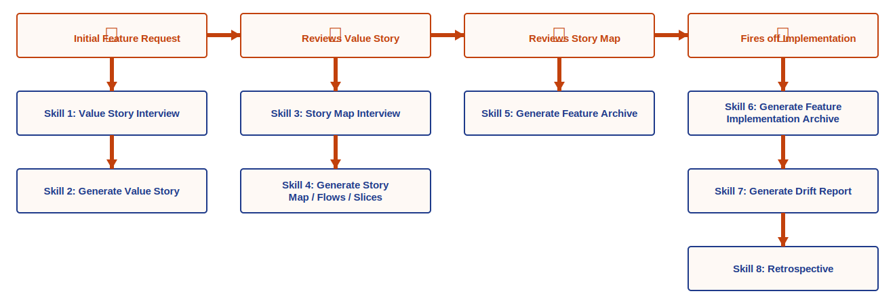
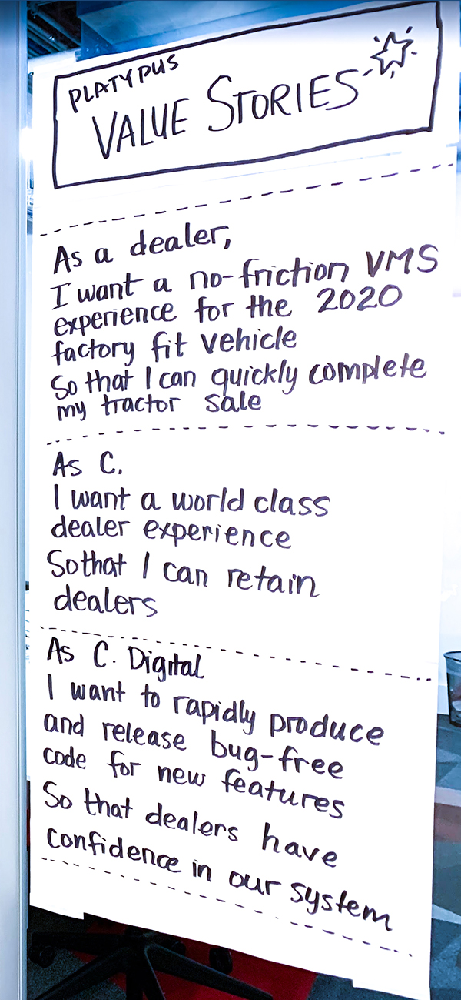
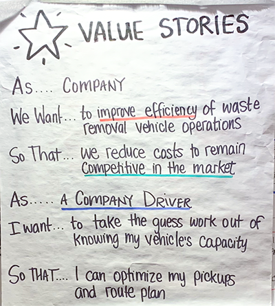
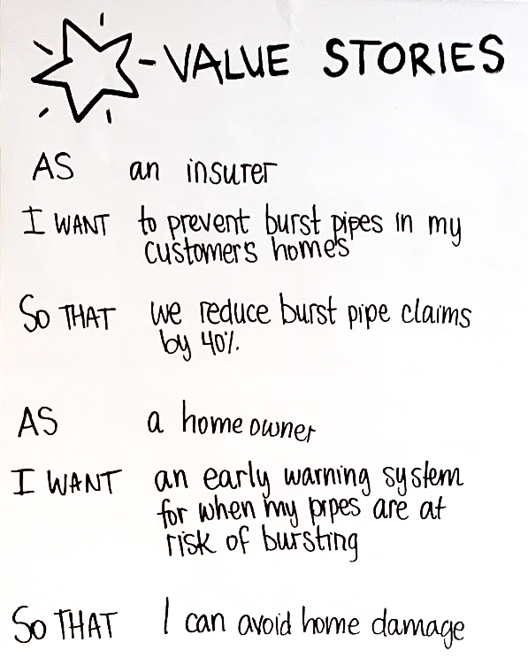

# <span style="color:#76a039">Research Agent Skill Workflow</span>

## <span style="color:#76a039">Workflow Overview</span>

Note: the following is partially generated from thoughts from `workflow.txt`.

<table><tr><td valign="top">
<ul style="font-size:18px; line-height:2; list-style:none; padding-left:0;">
<li><span style="color:#c2410c; font-weight:bold;">👤 Initial Feature Request</span></li>
<li><span style="color:#1e3a8a; font-weight:bold;">Skill 1:</span> Value Story Interview</li>
<li><span style="color:#1e3a8a; font-weight:bold;">Skill 2:</span> Generate Value Story</li>
<li><span style="color:#c2410c; font-weight:bold;">👤 Reviews Value Story</span></li>
<li><span style="color:#1e3a8a; font-weight:bold;">Skill 3:</span> Story Map Interview</li>
<li><span style="color:#1e3a8a; font-weight:bold;">Skill 4:</span> Generate Story Map / Flows / Slices</li>
<li><span style="color:#c2410c; font-weight:bold;">👤 Reviews Story Map</span></li>
<li><span style="color:#1e3a8a; font-weight:bold;">Skill 5:</span> Generate Feature Archive</li>
<li><span style="color:#c2410c; font-weight:bold;">👤 Fires off Implementation</span></li>
<li><span style="color:#1e3a8a; font-weight:bold;">Skill 6:</span> Generate Feature Implementation Archive</li>
<li><span style="color:#1e3a8a; font-weight:bold;">Skill 7:</span> Generate Drift Report</li>
<li><span style="color:#1e3a8a; font-weight:bold;">Skill 8:</span> Retrospective</li>
</ul>
</td><td valign="top" style="padding-left:24px;">

</td></tr></table>

---
Note: some of the human in the loop steps could end up being a new agent in the workflow down the road.

### <span style="color:#76a039">👤 1. Initial Feature Request</span>

The raw feature ask from a human — a sentence, ticket, or idea in any form. The starting trigger for the whole workflow.

### <span style="color:#76a039">Skill 1: Value Story Interview</span>

Interviews the human conversationally to surface the persona, their friction, and what success looks like for them.

### <span style="color:#76a039">Skill 2: Generate Value Story</span>

Drafts the structured persona-level value story from the interview transcript.

### <span style="color:#76a039">👤 4. Reviews Value Story</span>

Human approves or refines the generated value story before moving forward.

### <span style="color:#76a039">Skill 3: Story Map Interview</span>

Interviews the human about the feature flow — backbone features, tasks, and the first release slice.

### <span style="color:#76a039">Skill 4: Generate Story Map / Flows / Slices from Value Story</span>

Generates the story map artifact from the interview, including features, tasks, and the proposed first slice.

### <span style="color:#76a039">👤 7. Reviews Story Map</span>

Human approves or refines the story map before implementation planning begins.

### <span style="color:#76a039">Skill 5: Generate Feature Archive</span>

Generates a pre-implementation archive documenting the planned feature — the source of truth before a line of code is written.

### <span style="color:#76a039">👤 9. Implementation</span>

Human or dev team builds the feature.

### <span style="color:#76a039">Skill 6: Generate Feature Implementation Archive</span>

Documents what was actually built during implementation, capturing any decisions or deviations made along the way.

### <span style="color:#76a039">Skill 7: Generate Drift Report</span>

Compares the planned feature archive against the implementation archive to surface any drift between intent and delivery.

### <span style="color:#76a039">Skill 8: Retrospective</span>

Reflects on the full workflow — what went well, what to improve, and what to carry forward to the next feature.

---

## <span style="color:#76a039">Skill 1: Value Story Interview</span>

  

### <span style="color:#76a039">Value Story Structure</span>

A value story file has three sections. Each section is its own value story.
For every new feature, you always start with Section 1.

Each value story follows this format:

```
As a (an) [persona]
I want [feature/goal]
So that [benefit/outcome]
```

**Section 1 — Persona (required, always first)**
The personal-level value story. Focuses on the WHO: who the user/persona is,
what friction they experience, and what value they gain from the feature.

**Section 2 — Business**
The business-level value story. Focuses on the goal or outcome at the
organizational level.

**Section 3 — Tech (optional)**
A tech-oriented value story. Only included when there is meaningful technical
value worth articulating (e.g. a platform improvement, architectural win, or
developer experience gain).

This skill interviews specifically for Section 1 — the persona-level value story.

---

### <span style="color:#76a039">Interview style: structured vs. conversational</span>

#### <span style="color:#76a039">Structured</span>
Ask a fixed list of questions in sequence,

#### <span style="color:#76a039">Conversational</span>
Ask an opening question and dynamically follow up based on answers. 

Conversational feels more natural but requires the
skill to know when it has enough to stop. 

Lean conversational with a loose framework
underneath — enough structure to ensure the right topics get covered, but not a rigid form.

### <span style="color:#76a039">What "enough" looks like</span>
The interview needs a stopping condition. Since this skill targets Section 1 (persona),
it aims to surface:
- Who the persona is
- What friction or problem they currently have
- What success looks like for them

When it has confident answers to all three, it wraps up and drafts the persona-level
value story rather than continuing to ask questions.

### <span style="color:#76a039">Personas</span>

Any persona surfaced during the interview is saved to a shared `personas.md` file.
This file lives outside of feature folders since personas are reusable across features:

```
features/
  personas.md
  color-swatch-export/
    value-story.md
```

**On first run:** the skill interviews freely and creates the persona, appending it to
`personas.md` when done.

**On subsequent runs:** the skill reads `personas.md` and opens by offering the user a
numbered list of existing personas to choose from, or the option to create a new one.
If an existing persona is chosen, the interview skips persona discovery and focuses on
the feature-specific friction and success criteria for that persona.

### <span style="color:#76a039">Output</span>
One generated `.md` file containing the Value Story followed by the full interview
transcript below it for reference. Everything in one place — no hand-off, no separate
files.

#### <span style="color:#76a039">Output file naming options</span>

**Option A — kebab-case, descriptive**
```
value-story.md
```

**Option B — include feature name**
```
value-story-{feature-name}.md
```
e.g. `value-story-color-swatch-export.md`

**Option C — folder per feature (✅)**
```
features/
  color-swatch-export/
    value-story.md
    story-map.md        ← future skills drop their output here too
    feature-archive.md
```
Each feature gets a folder; each skill in the workflow writes its artifact into it.
Scales naturally as the workflow grows.

### <span style="color:#76a039">Framework alignment (open question)</span>
Decide which story mapping framework to anchor to before writing the prompt:
- Jeff Patton's User Story Mapping
- Jobs-to-be-Done
- Something custom

The choice shapes which questions the interviewer prioritizes.

---

## <span style="color:#76a039">Skill 3: Story Map Interview</span>

Takes the approved value story as input and interviews the user to gather what is needed
to build the story map. Where Skill 1 focused on the persona and their friction, this
interview focuses on the feature itself — the user features, tasks, and first slice.

### <span style="color:#76a039">Input</span>

Reads the `value-story.md` from the feature folder to anchor the interview on the
already-approved persona, goal, and outcome before asking any questions. Also reads the
original Initial Feature Request for any feature ideas or scope hints the user expressed
up front.

### <span style="color:#76a039">Pre-populating the story map from prior context</span>

Before asking the user anything, the skill mines the two prior artifacts for story map
seed material:

- **Initial Feature Request** — scans for any explicit feature ideas, named capabilities,
  or scope hints the user mentioned when they first described what they wanted.
- **Value Story Interview transcript** — pulls out any features, sub-goals, or "and also…"
  tangents the user surfaced while describing their persona's friction and success criteria.

The skill then attempts to draft a skeleton story map from whatever it finds: backbone
features, candidate tasks, and a rough first-slice guess.

**If enough seed material exists:** the skill presents the draft to the user and asks
them to confirm, adjust, extend, or discard it:

> *"Here's a first-pass story map I drafted from your feature request and value story
> interview. Would you like to:*
> *1. Use this as a starting point*
> *2. Adjust or extend it*
> *3. Discard it and start fresh"*

If the user chooses **Discard**, the draft is thrown away and the skill drops directly
into the Add Feature loop (see below), treating the map as empty and prompting the user
to add the first feature manually.

**If not enough exists:** the skill prompts the user directly — *"I don't have enough
detail yet to sketch the story map. What's a feature you'd like to start with?"* — and
uses their answer as the first item on the map before continuing the interview.

### <span style="color:#76a039">What the interview surfaces</span>

- The backbone: the high-level user features involved in achieving the goal
- The tasks under each feature (the walking skeleton)
- The first release slice — the minimum set of tasks that delivers real value

### <span style="color:#76a039">Interview style</span>

Same conversational-with-structure approach as Skill 1. Opens by summarizing the value
story so the user can confirm or correct the framing, then presents any pre-populated
map seeds before moving into the feature flow.

### <span style="color:#76a039">What "enough" looks like</span>

The interview wraps when it has:
- One or more backbone features but limit it to one at a time as the default.  
  - Give them the option to add more now, but mention that we are recommending them to keep things lean and urging them 
    to just define one for now, one WIP at a time
- At least one layer of tasks under each feature
- A proposed first slice identified

### <span style="color:#76a039">Iterative map building: the "Add Feature" loop</span>

Once the story map has its first feature added (via a separate **Add Feature** skill
that appends a feature to the map), the skill does not stop — it prompts the user to
keep evolving the map:

> *"Feature added. Would you like to:*
> *1. Add another feature to the story map*
> *2. Elaborate on an existing feature or task*
> *3. Revisit or refine the first release slice*
> *4. Done for now"*

This mirrors the real-world practice of working through a story map collaboratively —
the map is always a draft in progress, not a one-shot output. The loop continues until
the user chooses "Done for now."

Each iteration can either add a new backbone activity + tasks or deepen an existing one,
letting the map grow organically across the conversation.

### <span style="color:#76a039">Output</span>

Appends a `story-map-interview.md` to the feature folder alongside `value-story.md`.
Skill 4 reads this file to generate the story map artifact.

```
features/
  color-swatch-export/
    value-story.md
    story-map-interview.md   ← output of this skill
    story-map.md             ← generated by Skill 4
    feature-archive.md
```
