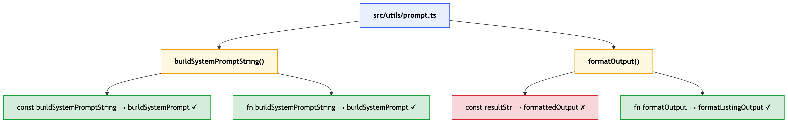

# Refactor Skill — Naming Research Notes
_2026-05-14_

Naming-specific research for the `/refactor` skill. For general skill notes see `2026-05-14-research-refactor-skill.md`.

---

## Processing Strategy (Inside-Out)

Code-first — no upfront domain interview. The inside-out strategy is the inference mechanism: by reading constants and conditionals before naming a function, the agent builds domain context organically from the code itself.

For each file:

1. Pick the **smallest function** in the file
2. Inside that function, identify **constants** — propose renames first
3. **Note any conditionals** — read their branches to understand what behavior the function is guarding
4. Use constants and conditional behavior to **propose a rename for the function itself**
5. Move to the next smallest function and repeat
6. When all functions in a file are done, move to the next file

---

## Hypothesis & Analysis

Each `/refactor` session is treated as an experiment. The user states their hypothesis upfront, and the skill produces an analysis at the end for review.

### On Start — Hypothesis Prompt

After announcing scope and file order, the skill asks two questions in sequence:

```
1. What's your hypothesis for this refactor session?
   (e.g. "I think most names are implementation-focused and miss the business domain")

2. What's your prediction — what specifically would you expect to see if your hypothesis is true?
   (e.g. "I expect to find type suffixes in more than half the constants, and function
   names using build/format/process with no domain context")
```

Both responses are recorded verbatim and written to the session log immediately.

### At Session End — Analysis, Verdict & Learnings

After all renames are processed (and before generating the tree diagram), the skill produces:

1. **Analysis** — what actually happened:
   - Which naming patterns appeared most (type suffixes, vague verbs, missing domain language, etc.)
   - How many proposals were accepted vs. rejected and what that might indicate

2. **Verdict** — a single explicit call based on whether the prediction held: `confirmed`, `refuted`, or `partial`

3. **Learnings** — what this session revealed that wasn't known before; what to do differently

4. **Next Hypothesis** — what this session suggests should be tested next

The skill presents all four sections and asks:

```
Approve or reject this analysis?
```

- **approve** → written to the session log as-is.
- **reject** → skill prompts: *"Type your own analysis:"* and records whatever the user writes instead.

### In the Session Log

The full experiment block is written at the top of the session log (e.g. `docs/refactorings/utils/refactor-names-utils-prompt-<timestamp>.md`), before the rename entries:

```
## Hypothesis
I suspect not all the names in here are domain driven and some are not written
in prose and are instead written based on technology or implementation based terms.

## Prediction
I expect to find a mix — some names will be fine, others will reference
technology concepts (String, Array, Handler, Manager, Utils) or describe
what the code does mechanically rather than what it means in the business.
I don't expect it to be uniformly bad.

## Verdict
partial

## Analysis
The hypothesis held partially. About half the names were acceptable —
a few already read as domain language. The other half leaned on
technology terms (String, Obj, Handler) or mechanism verbs ("process",
"handle", "manage") that describe the how not the what. No names were
actively wrong, but several were vague enough that a new developer
wouldn't know what business concept they referred to without reading
the implementation.

## Learnings
A general hypothesis like this is hard to confirm or refute cleanly —
"not all" is almost always true. Future sessions will be more useful
with a sharper prediction (e.g. "I expect more than half to have
technology terms"). The partial result also suggests this file is
mid-quality naming, not a disaster — the inside-out strategy found
fewer high-confidence renames than expected.

## Next Hypothesis
The weakest names were on the boundary functions — the ones that
coordinate between layers. I suspect those coordination-layer functions
are the most likely to have technology-focused names because they were
written to wire things together, not to express business intent.

---

## Constants
buildSystemPromptString -> buildListingPrompt [accepted]
inputDataObj -> product [accepted]
resultStr -> resultStr [rejected]

## Functions
handleResponse -> handleResponse [rejected]
processData -> generateColorSwatch [accepted]
formatOutput -> formatListingOutput [accepted]
manageState -> manageState [rejected]

## Tests
(none this session)
```

---

## Proposal Format

Each rename proposal looks like:

```
[File: src/utils/prompt.ts]

const buildSystemPromptString  →  buildSystemPrompt
Why: the name includes the type ("String") which is an implementation detail,
     not behavior. The name already implies it builds something; the return
     type is evident from context.

Accept? (yes / no)
```

- If **accepted**: apply the rename, append to session log, move on.
- If **rejected**: try one more suggestion with a different name + explanation.
- If **rejected again**: skip silently, move on.

---

## Session Log

Each `/refactor` session produces two companion files, grouped under a subfolder named after the immediate parent folder of the target file or folder:

**Single file** (e.g. `src/utils/prompt.ts`):
```
docs/refactorings/utils/refactor-names-utils-prompt-<timestamp>.md       ← flat rename log
docs/refactorings/utils/refactor-names-utils-prompt-<timestamp>-tree.mmd ← Mermaid tree diagram
```

**Folder** (e.g. `src/utils/`):
```
docs/refactorings/utils/refactor-names-utils-<timestamp>.md       ← flat rename log
docs/refactorings/utils/refactor-names-utils-<timestamp>-tree.mmd ← Mermaid tree diagram
```

Created at session start, appended to after each proposal resolves (accept or final rejection).

### Flat Log

Starts with a `## Session Info` block written at session start, followed by the experiment block, then the rename entries:

```
## Session Info
Date: 2026-05-15T10-30-00
Models: claude-sonnet-4-6
Total Tokens: 24,318

---

## Hypothesis
...

## Prediction
...

## Verdict
...

## Analysis
...

## Learnings
...

## Next Hypothesis
...

---

## Constants
buildSystemPromptString -> buildSystemPrompt [accepted]
resultStr -> formattedOutput [rejected]

## Functions
ExamplesList -> ColorSwatchList [accepted]
isDataValid -> hasRequiredFields [rejected]

## Tests
(none this session)
```

- **Models** — written at session start; lists every model used (primary agent first, then any sub-agents).
- **Total Tokens** — filled in automatically at session end by a global Stop hook. The hook script lives at `hooks/end-refactor-log-session-stats.sh` in this repo and is installed to `~/.claude/hooks/` via `install.sh`. No user action required at runtime.

#### How Automatic Token Tracking Works

See `2026-05-14-research-refactor-skill.md` → **Custom Hooks / end-refactor-log-session-stats.sh** for the full three-part handoff design.

### Refactor Names Tree Diagram (claude-mermaid)

A completely different view from the flat log. Where the log groups by construct type, the tree mirrors the actual code structure — file → function → what was renamed inside that function. It shows *where* in the code the renames happened and how deep the skill went.

Example: if the skill entered `buildSystemPromptString()`, renamed a constant inside it, then renamed the function itself, the tree reflects that nesting:



Accepted and rejected renames both appear (green / red). Generated by claude-mermaid at session end. Placed alongside the flat log so both views of the same session are always together.

---

## Quality Scoring Ideas

Each `/refactor` session produces a log and a hypothesis result. A quality score could add a third output: a measurable signal of how much the naming improved and where the worst problems were.

Three approaches worth considering:

### 1. Depth-of-change per rename

Rate each accepted rename at the moment it's logged on a 3-tier scale:

| Score | Label | Example |
|-------|-------|---------|
| `1` | Type Suffix Removed | `buildSystemPromptString → buildSystemPrompt` |
| `2` | Behavior Named | `processData → generateColorSwatch` |
| `3` | Domain Term Surfaced | `formatOutput → formatListingOutput` |

The label is the rename type — a repeatable, specific category, not a quality tier. If a rename doesn't fit `Type Suffix Removed`, `Behavior Named`, or `Domain Term Surfaced`, the agent coins a new label that describes what changed. The user reviews and cleans up or renames labels over time. This is how the taxonomy grows: agent-driven discovery, user curation.

Roll up to a session average. Captures not just *how many* names were fixed, but *how far* they moved.

### 2. Pre/post quality baseline

Before proposing any renames, Claude scores each existing name on a rubric (e.g. 1–5, with penalties for type suffixes, vague verbs, absent domain terms). After the session, re-score the accepted names. The delta is the session's quality improvement.

Enables cross-file and cross-session comparison. Higher delta = naming was worse to start with and improved more.

### 3. Anti-pattern hit rate

Don't score quality directly — count which problems appeared and how often:

- Type suffixes present (`String`, `Array`, `Handler`, etc.)
- Vague verbs (`process`, `handle`, `manage`, `do`, `run`)
- No domain term present
- Name describes mechanism, not meaning

Report as a breakdown in the Analysis section. Aligns well with the hypothesis/prediction flow — the prediction can name an expected pattern, and the score confirms or refutes it.

**Trade-off to resolve:** Options 1 and 2 require Claude to self-assess (subjective but richer). Option 3 is mechanical (consistent but shallower). Option 1 is lowest friction — it piggybacks on the accept moment with no extra prompts.

---

## Capturing Rename Feedback in the Session Log

When a user rejects a proposal or provides context explaining why they accepted or rejected a name, that reasoning is valuable signal. It shouldn't be lost — it explains the *why* behind the decision in a way the flat `[accepted]` / `[rejected]` marker cannot.

### The problem

The current session log captures outcomes only:
```
STATE -> REFACTOR_LOG_AWAITING_TOKEN_COUNT [accepted]
SESSION_JSON -> REFACTOR_SESSION [accepted]
```

If the user said "use the why to name it, not a vague label" — that reasoning is gone after the session ends.

### Option A: Inline annotation

Append user context directly to the log entry, after the accepted/rejected marker:

```
STATE -> REFACTOR_LOG_AWAITING_TOKEN_COUNT [accepted] — "use the why to name it, not a vague label"
SESSION_JSON -> REFACTOR_SESSION [accepted] — "it represents a refactor session in progress, not just a stopped session"
SF -> REFACTOR_SESSION_FILE [accepted] — "keep UPPERCASE, we're in a script"
```

Pros: zero extra structure, everything visible at a glance in the rename list.
Cons: long lines if the comment is verbose.

### Option B: Separate `## Feedback` section

Keep the rename list clean; collect all feedback at the bottom of the log:

```
## Feedback
STATE: "use the why to name it, not a vague label"
SESSION_JSON: "it represents a refactor session in progress, not just a stopped session"
SF: "keep UPPERCASE, we're in a script"
```

Pros: log list stays scannable; feedback is grouped for review.
Cons: two places to look; linking renames to feedback requires matching names manually.

### Open questions

- Should feedback be captured on rejections only, or on any proposal where the user says something beyond yes/no?
- Should the agent prompt for context explicitly ("Any reason for that?") or only record what the user volunteers?
- Does the feedback belong in the flat log, the global knowledge base (see `2026-05-14-research-refactor-skill.md`), or both?

Option A is lower friction and better for the global knowledge base feed (the raw material is right there in the rename entry). Worth prototyping first.

---

## Open Questions

- What constructs beyond constants and functions should be renamed? (variables, test names, React components — noted in original brainstorm but not yet scoped)
- How should feedback be captured per rename — inline annotation or separate section? (see above)
