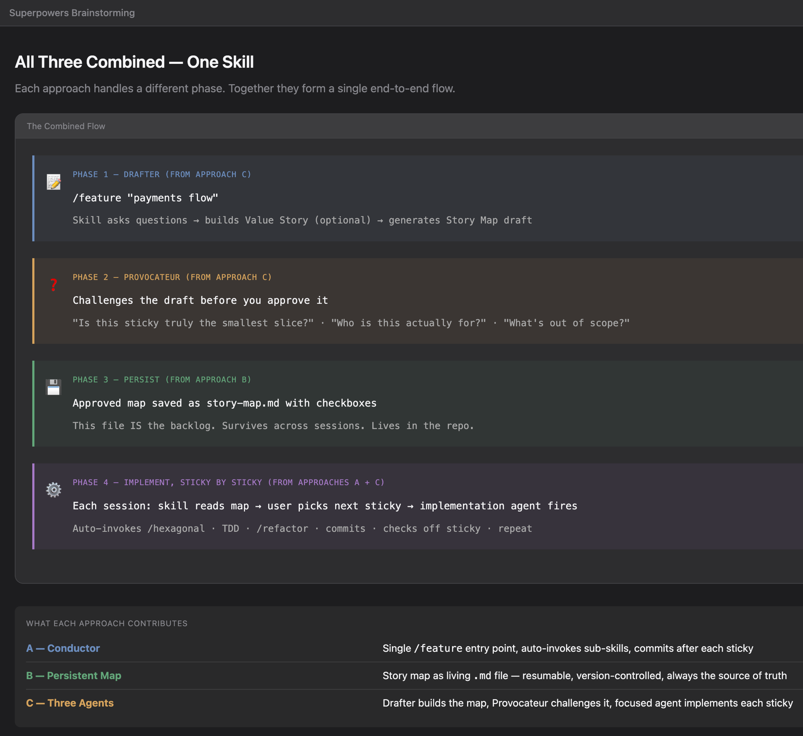
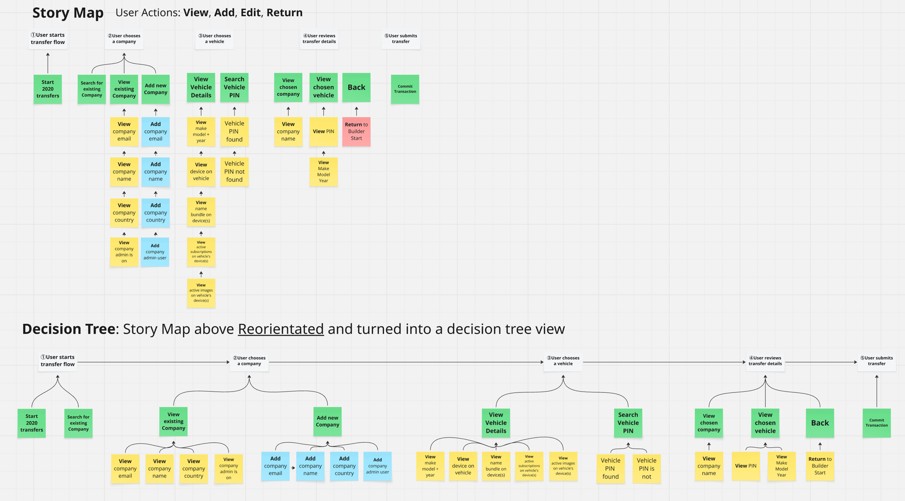
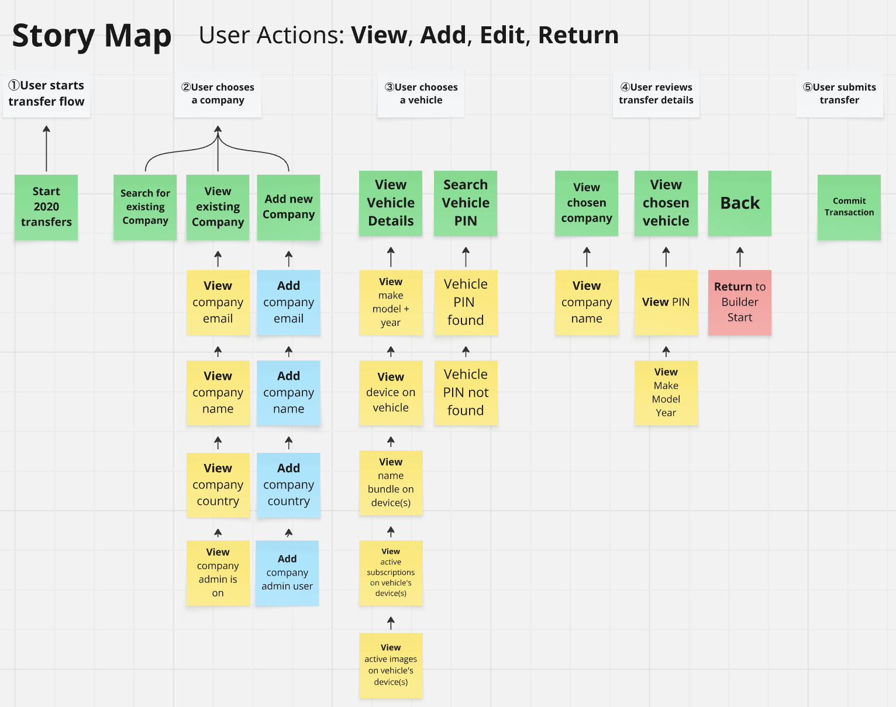
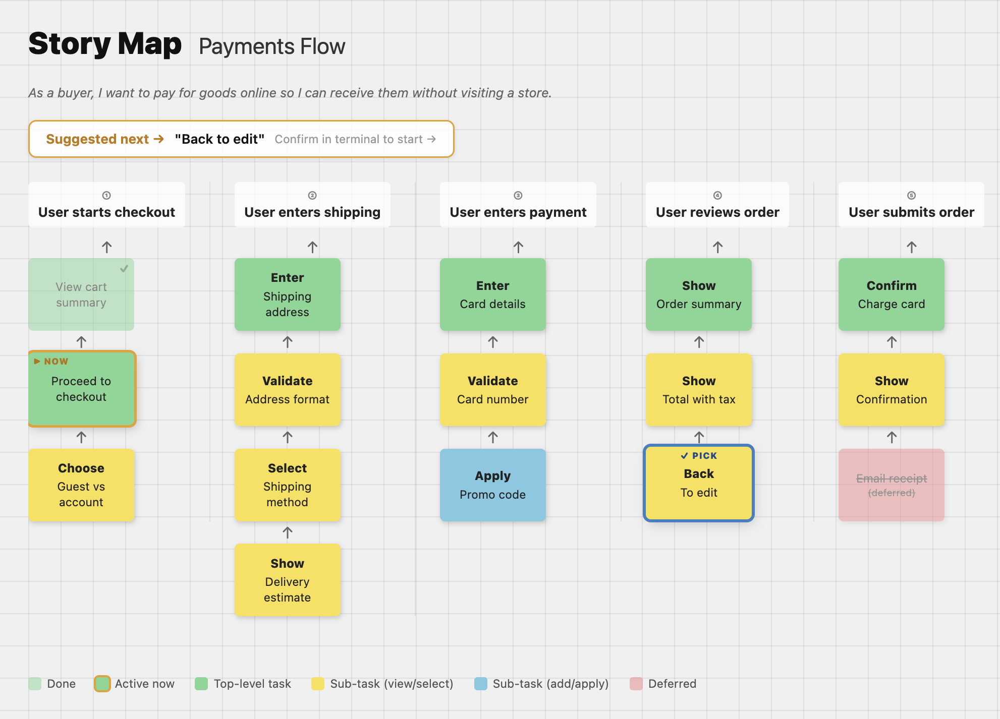
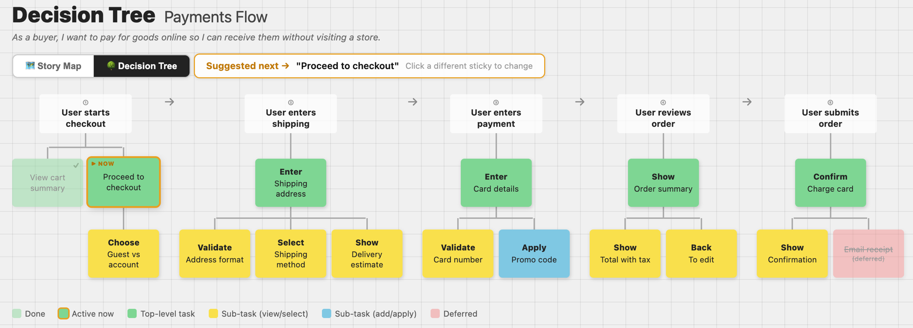

# Feature Skill — Design Spec

> **Plan:** _link to be added when implementation plan is written_
>
> **Related specs:**
> - [Hexagonal Architecture Skill](../skills/2026-05-17-hexagonal-architecture-skill.md) — sub-skill invoked per non-cosmetic sticky
> - [Hexagonal Invocation Modes — brainstorm in progress](../skills/2026-05-17-hexagonal-invocation-modes.md) — refines how `/hexagonal` is invoked from `/feature` (greenfield vs brownfield)
> - [TDD Skill](../skills/2026-05-17-tdd-skill-design.md) — sub-skill invoked per non-cosmetic sticky as the code-writing driver
> - [Claude Design — research notes](../2026-05-17-claude-design-research.md) — why we decided not to depend on Claude Design for v1

---

## Overview

A Claude Code skill (`feature.md`) that drives feature development from initial idea through sticky-by-sticky implementation using Extreme Programming principles. It combines three patterns into one end-to-end flow: a guided Drafter phase that builds a story map through natural questions, a Provocateur phase that challenges the draft before approval, a persistent story map file as the living backlog, and a conductor that implements one sticky at a time by auto-invoking sub-skills.

Agents pick this up automatically when building any feature slice. Users invoke it explicitly with `/feature`.

---

## Design References

<p><strong>Combined flow diagram:</strong><br/>
</p>

<p><strong>Physical story map reference:</strong><br/>
</p>

<p><strong>Story map vs decision tree:</strong><br/>
</p>

<p><strong>Digital story map reference:</strong><br/>
</p>

<p><strong>Target story map UI:</strong><br/>
</p>

<p><strong>Decision Tree toggle view:</strong><br/>
</p>

---

## Invocation

```
/feature "payments flow"     # named feature
/feature                     # skill asks for feature name
(agent auto-invokes)         # trigger: task involves building a named feature or user story
```

---

## UI Stack and Distribution

The story map UI is a Koa + React app served locally during a `/feature` session. Lives in `feature-ui/` within the vflow repo. **Live from Phase 1 onward** so the user can watch the map build during Drafter/Provocateur and watch stickies flip to done during Phase 4.

### Stack

| Layer | Choice |
|---|---|
| Server | **Koa** (small, idiomatic Node) |
| Bundler | **Vite** |
| Framework | **React** |
| Live updates | **Server-Sent Events (SSE)** — server pushes on `story-map.md` change |
| Styling | **Custom CSS** matching the spec screenshots; no Tailwind, no shadcn |
| Component organization | **Atomic design** — atoms / molecules / organisms / templates / pages — hand-built |
| Package manager | **pnpm** (never npm) |
| Distribution | Built at install time — `install.sh` runs `pnpm install && pnpm build` in `feature-ui/` |

### Lifecycle

- Server starts when `/feature` is invoked (Phase 1).
- Server stops when the feature session ends or the user explicitly closes.
- Markdown → HTML/state regeneration triggers at: every Drafter answer, every Provocateur revision, every sticky check-off in Phase 4.
- (PID tracking, port allocation, regeneration mechanism details — see [Open Questions](#brainstorm-in-progress--open-questions).)

### Atomic design organization

- **Atoms** — primitives: `<Sticky>`, `<ArrowUp>`, `<Checkbox>`, `<Badge>`, `<ColumnHeader>`, `<GridBackground>`
- **Molecules** — small compositions: `<StickyWithArrow>`, `<SuggestionBarContent>`
- **Organisms** — full sections: `<ActivityColumn>`, `<SuggestionBar>`
- **Templates** — layouts: `<BoardLayout>` (the grid + suggestion bar slot)
- **Pages** — stateful roots: `<StoryMapPage>` (owns SSE subscription, parses state, feeds the template)

The atom library is the foundation. Reusable for /feature v2 (click-to-select), the future Decision Tree view, and future skill UIs.

> **Why not Claude Design?** Documented in the [Claude Design research spec](../2026-05-17-claude-design-research.md). Short version: it's a hosted prototyping product, not an installable library; no clean export path; output not shaped for hardened distributed code.

---

## Four Phases

### Phase 1 — Drafter

Skill asks natural questions to understand the feature — no story map terminology exposed to the user. The agent owns the mapping to story map structure internally.

Questions (one at a time):
1. What is the feature name?
2. Value Story (optional — user can skip): *As a [persona], I want [goal], so that [outcome]*
3. Who are the personas involved?
4. What are the main things each persona needs to accomplish?
5. For each accomplishment, what are the individual steps to get there?

From the answers the agent produces a draft story map: accomplishments become activity columns, steps become task stickies beneath each activity.

### Phase 2 — Provocateur

Before the user approves the draft, the skill challenges it with targeted questions:

- "Are there any stickies we could split further? Remember we want to work on the simplest thing possible. We're talking very, very small."
  - **Why XP pushes for the smallest possible slice:**
    - **Faster feedback** — a small slice that's "done" teaches us something *now*, not in two weeks. We find out we're wrong (or right) before we've sunk effort into the wrong direction.
    - **Smaller blast radius** — when something breaks (and it will), a tiny commit is easy to revert. A big one is a debugging archaeology dig.
    - **Better flow through RED → GREEN → REFACTOR** — small slices cycle cleanly; big ones get stuck half-done, half-tested, half-refactored.
    - **Less cognitive load** — what fits in your head is what you can ship without bugs. Big slices hide complexity in places no one is looking.
    - **Earlier value or earlier course-correction** — even a 30-minute slice can confirm or invalidate the design assumption underneath the whole feature.
    - **Smaller integration cost** — small commits merge cleanly; big ones turn into conflict-resolution sessions.
    - **Easier to pair on or hand off** — small slices have clear start and end points; big ones are hard to share.
- "What's the smallest set we'd commit to right now, and what should we defer? We want low WIP and the most important work first; everything else either waits or gets cut."
  - **Why XP and Lean limit WIP and force prioritization:**
    - **Low WIP = faster flow** — fewer things in-flight means each thing finishes (and ships) sooner.
    - **Prioritization forces value clarity** — if we can't say what's most important right now, we don't fully understand the feature yet.
    - **Highest-priority first reduces risk** — if we have to stop, we've already shipped what mattered most. The opposite (everything half-done) leaves nothing usable.
    - **Less context-switching** — a focused queue keeps the brain (and the test suite) on one thread instead of fragmenting attention across many parallel ideas.
    - **Cut = saved effort** — anything we don't actually need is the best work to skip. YAGNI applied at the sticky level.
    - **Deferred ≠ deleted** — deferred stickies stay visible on the board so they're not forgotten, but the model never suggests them as next.
    - **Late prioritization is cheaper than early commitment** — deferring something now is easy; unwinding six weeks of code built around a wrong priority is not.
- "Is the Value Story still accurate given this map?"
- "Is there a persona missing from any column?"

User can revise or approve as-is.

### Phase 3 — Persist

On approval, the skill writes two files to `story-maps/<feature-name>/`:

**`story-map.md`** — canonical source of truth, always written, portable to Miro and other tools:

```markdown
# Payments Flow

> As a buyer, I want to pay for goods online so I can receive them without visiting a store.

## User starts checkout
- [x] View cart summary
- [ ] Proceed to checkout
- [ ] Guest vs account choice

## User enters shipping
- [ ] Enter shipping address
- [ ] Validate address format
- [ ] Select shipping method
- [ ] Show delivery estimate

## User enters payment
- [ ] Enter card details
- [ ] Validate card number
- [ ] Apply promo code

## User reviews order
- [ ] Show order summary
- [ ] Show total with tax
- [ ] Back to edit

## User submits order
- [ ] Confirm and charge card
- [ ] Show confirmation screen
- [ ] ~~Email receipt~~ *(deferred)*
```

**Markdown rules:**
- `##` headings = activity columns
- `- [ ]` = task to do, `- [x]` = done, `~~text~~ *(deferred)*` = out of scope
- Value Story as a blockquote directly under the feature title

**`story-map.html`** — generated from the markdown, served locally as the visual board. Always regenerated from markdown after any update — the markdown is the single source of truth, HTML is always derived.

**What lives on disk:**
```
<project-root>/
  story-maps/
    payments-flow/
      story-map.md      ← canonical, portable
      story-map.html    ← generated visual board
```

### Phase 4 — Implement, sticky by sticky

Each session the skill reads `story-map.md` top to bottom, finds the first unchecked `- [ ]`, and surfaces it as the suggestion:

> *"Suggested next: 'Proceed to checkout' — confirm, or pick another"*

**Sticky selection (v1 — read-only board):**
1. **Confirm the suggestion** — say yes in terminal
2. **Type it** — name a sticky directly in terminal

(Click-to-select in the visual board is v2 — see [Open Questions](#brainstorm-in-progress--open-questions).)

Once a sticky is confirmed active, the board highlights it (gold border + "▶ NOW" label) in real time via SSE.

#### Per-sticky classification (one-time at Phase 4 start)

Before any sticky runs, `/feature` determines two things for every unchecked sticky:

- **`targetService`** — which service folder the sticky's behavior belongs to (e.g. `payments`, `shipping`).
- **`scope`** — one of: `cosmetic`, `ui-only`, `ui-and-server`, `server-only`.

Both classifications use the same **dual-mode pattern**. At Phase 4 start, `/feature` asks once:

> *"How should I classify each sticky's service and scope? (a) I propose, you review and approve in bulk. (b) You specify per sticky as we go."*

- **Mode A — agent proposes, bulk review.** `/feature` analyzes each sticky against the workspace (existing service folders) and the sticky text, then presents a table mapping every sticky to (service, scope) with reasoning. User edits any row inline, approves the whole table once, then Phase 4 runs with no further classification prompts.
- **Mode B — user specifies per sticky.** Before each sticky's implementation, `/feature` prompts: *"Sticky 'X' — target service? scope?"*. User answers, skill proceeds.

The user can **switch modes mid-feature** (e.g. mode A for most stickies, fall back to mode B for an ambiguous sticky).

#### Per-sticky implementation flow (scope-driven)

Once a sticky is confirmed active and classified, the implementation flow branches on `scope`. Sticky-scope rules are derived from the user's TDD/architecture conventions (see `GUIDELINES.md`-style references — P0.0, P0.9, T1.3.1, T1.12–T1.14, A1.6.8 — applied here as the model for how far outside-in TDD should reach).

| Scope | Flow |
|---|---|
| **`cosmetic`** | `/feature` makes the edit directly. Runs existing test suite to confirm nothing broke. Commits as `feat: <sticky-slug>: <text>`. Checks off the sticky. **No `/tdd`, no `/hexagonal`.** |
| **`ui-only`** | (1) Invoke `/hexagonal <targetService>` (brownfield) to enforce frontend hex layers (hook → repository → data on the client). (2) Write `.tdd-context.json` (see below). (3) Invoke `/tdd "<sticky text>"` — outside-in TDD starting at the **hook layer**. Component scaffold (the View) is Step 1, **non-TDD**. `/tdd` handles per-increment commits, sticky check-off, and `.tdd-context.json` cleanup. |
| **`ui-and-server`** | Same as `ui-only` but `/hexagonal` enforces both frontend AND backend hex layers, and `/tdd` drives outside-in through every layer top-to-bottom (UI scaffold non-TDD → hook → controller → use-case → repository → data, each TDD'd). |
| **`server-only`** | (1) Invoke `/hexagonal <targetService>` (brownfield) to enforce backend layers (controller → use-case → repository → data). (2) Write `.tdd-context.json`. (3) Invoke `/tdd` — outside-in TDD starting at the **controller layer**. |

After `/tdd` (or `/feature`, for cosmetic stickies) finishes, `/feature` resumes:

1. Regenerate `story-map.html` (which triggers SSE to update the live board)
2. Surface the next unchecked sticky

**Deferred stickies** are never suggested as next. Visible in the board but skipped. User can un-defer by editing the markdown directly.

**Done signal:** When all non-deferred stickies are checked, `/feature` surfaces a completion summary (stickies completed, stickies deferred, stickies cut) and asks if the feature is ready to close out.

---

## Sub-Skill Composition

`/feature` orchestrates three sub-skills per non-cosmetic sticky. Understanding their relationship makes the Phase 4 flow readable.

- **`/tdd` is the driver.** It's the workflow that actually writes code. RED → GREEN → REFACTOR cycles, per-increment commits, sticky check-off on completion.
- **`/hexagonal` is the shape.** It's the architectural law the written code must honor: layer rules, JS Module Pattern (Node) or idiomatic functional (Python), naming constraints, "what each layer must NOT do." Invoked **explicitly** for every non-cosmetic sticky. Brownfield mode dominant — greenfield mode only fires when a sticky's `targetService` is a new service that doesn't exist yet.
- **`/refactor` is the polish.** Already lives inside `/tdd`'s REFACTOR phase per the /tdd spec — invoked with `--output <log folder>` so refactor logs land alongside the TDD log. `/feature` never calls `/refactor` directly.

So when you read Phase 4 and see "invoke /hexagonal then invoke /tdd," it's not two parallel sub-skill ceremonies. It's one flow: `/feature` delegates code-writing to `/tdd`, `/tdd` honors the shape `/hexagonal` demands, and `/tdd` grooms naming via `/refactor` at the REFACTOR moment. `/feature` is the conductor; the sub-skills are the orchestra sections.

### Composition contract — `.tdd-context.json`

Before invoking `/tdd`, `/feature` writes the state file with:

```json
{
  "feature": "payments-flow",
  "sticky": "Apply promo code",
  "storyMapPath": "story-maps/payments-flow/story-map.md",
  "targetService": "promotions",
  "scope": "ui-and-server"
}
```

`/tdd` reads this and adapts its opening flow:

- **Direction** is locked to `outside-in` for `/feature`-driven invocations (per the user's TDD conventions — outside-in always).
- **TDD starting layer** is derived from `scope` per the table above.
- `/tdd`'s opt-in question is still asked. (`cosmetic` stickies bypass `/tdd` entirely, so the opt-in only fires for non-cosmetic stickies.)

**Cross-reference:** The brownfield invocation surface for `/hexagonal` is still being designed in the [Hexagonal Invocation Modes brainstorm](../skills/2026-05-17-hexagonal-invocation-modes.md). The `targetService` field above is what `/feature` passes to `/hexagonal` per the contract being shaped there.

---

## Story Map UI

The visual board is a locally served React app (Koa + Vite + SSE — see [UI Stack and Distribution](#ui-stack-and-distribution)) generated from `story-map.md`. It is **not** a Kanban board — it is a tree-per-column layout where activity headers run left to right and task stickies hang vertically below each activity with upward arrows connecting levels.

**v1 is read-only display.** Sticky selection happens in the terminal. Click-to-select in the board is a v2 feature.

**Layout:**
- **Activity headers** — numbered, text only, one per column
- **Top-level stickies** (green) — first task directly under each activity
- **Sub-task stickies** — hang below with `↑` arrows. (Color sub-distinction "yellow = view/select, blue = add/apply" is **not in v1** — needs an annotation rule in markdown to be derivable. See [Open Questions](#brainstorm-in-progress--open-questions).)
- **Deferred stickies** (pink) — visible, struck through, not clickable
- **Done stickies** — muted green, checkmark, not clickable
- **Active sticky** — gold border, `▶ NOW` label (updates in real time via SSE when terminal selects a sticky)

**Suggestion bar** appears above the board showing the suggested next sticky. Updates via SSE.

**Grid background** — light gray crosshatch, white background.

**Polish target:** the spec screenshots are a *starting reference*, not a pixel target. v1 should be more refined than the rough screenshots — same overall shape and color language, more polish in spacing, typography, and atom-level details.

**Reference UI screenshot:** `2026-05-17-feature-skill-story-map-ui-final.png`

---

## Storage and Portability

Markdown is always written regardless of which visual option is in use. It is the portable artifact — Miro export, future tooling, and version control all read from it.

| Option | Status | Notes |
|---|---|---|
| Markdown (`story-map.md`) | Always written | Canonical source of truth |
| HTML board (local server) | Phase 1 UI | Generated from markdown |
| Miro via REST API | Future | Reads from markdown, pushes to Miro board |

---

## Future Features

- **Decision Tree view** — same story map data reoriented: activities become a horizontal spine, top-level task stickies hang below each activity, and sub-tasks fan out horizontally at each depth level. Toggle between Story Map and Decision Tree at any time without changing the underlying data. Title updates to match active view. No timeline set — not in first version. See reference: `2026-05-17-feature-skill-story-map-decision-tree.png`.
- **Miro export** — `##` headings map to Miro activity stickies, `- [ ]` items map to task stickies beneath them, via Miro REST API.

---

## Brainstorm In Progress — Open Questions

This spec is a **checkpoint** from a longer brainstorming session. The following questions are still being designed and will be folded in once decided:

### UI behavior
- **Server lifecycle details** — how `/feature` starts and stops the Koa server, PID tracking, port allocation, cleanup on Ctrl+C / SIGTERM.
- **Markdown → JSON state pipeline** — where the parser lives in `feature-ui/`, what the JSON schema looks like, what triggers regeneration on the server side.
- **SSE endpoint design** — route names, payload shape, fallback behavior if the SSE connection drops.
- **v2: click-to-select in the visual board** — requires either an events-file mechanism or a POST endpoint, neither designed in v1.

### Visual layer
- **Detailed atomic component inventory** beyond the high-level list in [UI Stack and Distribution](#ui-stack-and-distribution) — specific props, states, slot/composition rules per atom.
- **Polish target details** — what "more refined than the screenshots" actually looks like (typography choices, spacing system, sticky shadows, hover states for non-clickable elements).
- **Yellow / blue sub-task color distinction** — requires either an annotation rule in markdown (e.g. trailing tag) or it stays dropped in v1.

### Composition
- **Sticky classification UX** — combined-vs-separate question for `targetService` and `scope` in Mode A bulk review (one combined table or two separate tables?).
- **Done signal details** — exact format of the completion summary; what "closing out a feature" entails (archive the story-map folder? add a `*completed*` marker to `story-map.md`? leave as-is?).

### Repo structure
- **`feature-ui/` folder layout** — server/ vs client/ subfolders, where the markdown parser lives, where atoms vs templates live.
- **`install.sh` changes** for pnpm install + Vite build (idempotency, error handling, what happens if pnpm isn't installed).

### Sibling specs
- [Hexagonal Invocation Modes brainstorm](../skills/2026-05-17-hexagonal-invocation-modes.md) — open questions about brownfield invocation surface for `/hexagonal`.

---

## What This Spec Does Not Cover

- How the skill composes with future feature-archive or value-story skills
- Multi-user / team collaboration on a shared story map
- Branching within a sticky tree beyond flat vertical lists (future)
- CI/CD integration gates between stickies
